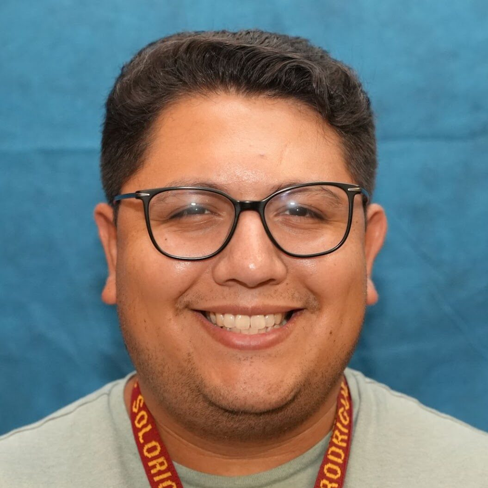

## Hi there my name is Francisco Rodriguez 👋

I have my bacherlor's degree from Illinois Tech and I am currently working on my master's at Saint Xavier University

The first piece of technology that I owned was a cell phone

My hometown is Chicago

My current personal interests involve building websites and theocratic activities.

People can reach me using my email fdrodriguezgarcia@cps.edu

I currently teach Exploring Computer Science at Solorio High School.

<!--
**franciscorod92-web/franciscorod92-web** is a ✨ _special_ ✨ repository because its `README.md` (this file) appears on your GitHub profile.

Here are some ideas to get you started:

- 🔭 I’m currently working on ...
- 🌱 I’m currently learning ...
- 👯 I’m looking to collaborate on ...
- 🤔 I’m looking for help with ...
- 💬 Ask me about ...
- 📫 How to reach me: ...
- 😄 Pronouns: ...
- ⚡ Fun fact: ...
-->
